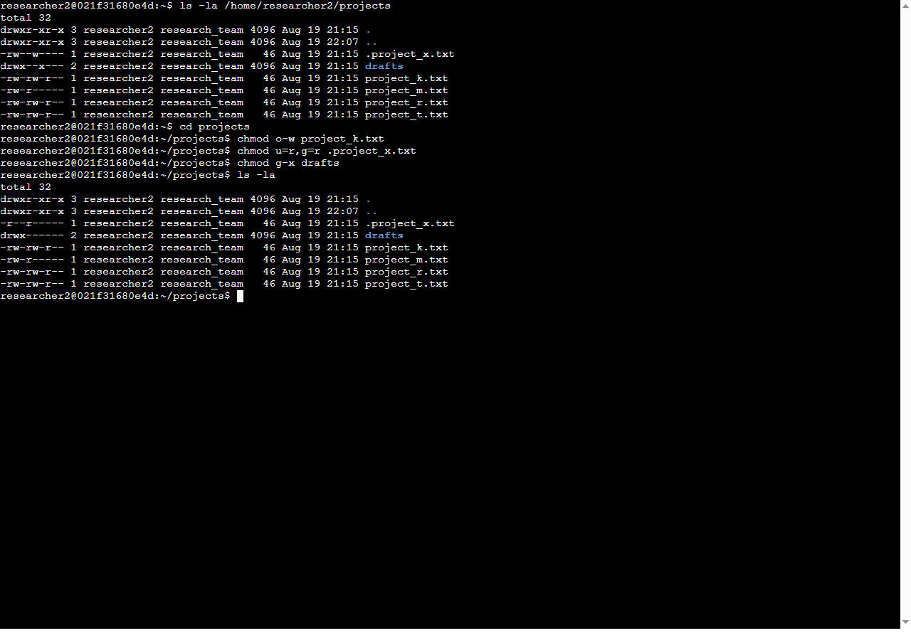

# File Permissions in Linux

**Date:** August 20, 2026  
**Author:** Chadrack Kalongo Kabinda  
**Course:** Google Cybersecurity Certificate – Course 4  

---

## Project Description

In this project, I used Linux commands to audit and manage file permissions for the research team's projects directory. The goal was to align the existing permissions with the organization's security policy, ensuring that only authorized users have appropriate access to files and directories, thereby reducing the risk of unauthorized data exposure or modification.

---

## Check File and Directory Details

To check the current permissions, I used the `ls -la` command. This lists all files and directories, including hidden ones (which start with a dot), and displays their detailed permissions, ownership, and modification times.

```bash
ls -la /home/researcher2/projects
```

**Output:**
`total 32
drwxr-xr-x  3 researcher2 research_team 4096 Aug 19 21:15 .
drwxr-xr-x  3 researcher2 research_team 4096 Aug 19 22:07 ..
-r--r-----  1 researcher2 research_team   46 Aug 19 21:15 .project_x.txt
drwx------  2 researcher2 research_team 4096 Aug 19 21:15 drafts
-rw-rw-r--  1 researcher2 research_team   46 Aug 19 21:15 project_k.txt
-rw-r-----  1 researcher2 research_team   46 Aug 19 21:15 project_m.txt
-rw-rw-r--  1 researcher2 research_team   46 Aug 19 21:15 project_r.txt`

---

## Describe the Permissions String

For example, the permissions string for `project_m.txt` is `-rw-r-----`.

- The first character `-` indicates it is a **regular file** (as opposed to a directory, which would be `d`).
- The next three characters `rw-` represent the **user (owner)** permissions: read and write.
- The following three characters `r--` represent the **group** permissions: read only.
- The last three characters `---` represent **others'** permissions: none.

---

## Change File Permissions

The organization does not allow others to have write access to any files. I reviewed the permissions and found that `project_k.txt` had write permissions for "others" (`-rw-rw-rw-`).

**Command used:**

```bash
chmod o-w project_k.txt
```

**Result:**
The permissions for `project_k.txt` changed from `-rw-rw-rw-` to `-rw-rw-r--`, ensuring that others can no longer modify the file while the user and group retain read and write access.

---

## Change File Permissions on a Hidden File

The hidden file `.project_x.txt` initially had write permissions for the user and group (`-rw--w----`), but the policy required that no one should have write access, while the user and group should be able to read the file.

**Command used:**

```bash
chmod u=r,g=r .project_x.txt
```

**Result:**
The permissions for `.project_x.txt` changed from `-rw--w----` to `-r--r-----`. This removed all write permissions, while granting read access to only the user and the group, aligning perfectly with the security requirements.

---

## Change Directory Permissions

The `drafts` directory initially had permissions `drwx--x---`, where the group had execute (but not read or write) access. The policy required that only `researcher2` should be allowed to access the `drafts` directory and its contents.

**Command used:**

```bash
chmod g-x drafts
```

**Result:**
The permissions for `drafts` changed from `drwx--x---` to `drwx------`. This removed the group's execute permission, ensuring that only the user (`researcher2`) has full read, write, and execute access. Group and others now have no access whatsoever.



---

## Summary

By systematically auditing the file and directory permissions using `ls -la` and applying corrective changes with `chmod`, I successfully tightened security for the research team. I removed write access for "others" on `project_k.txt`, restricted write access while preserving read access for the user and group on the hidden file `.project_x.txt`, and locked down the `drafts` directory so that only `researcher2` can access it. These measures ensure that sensitive project files are only accessible to the appropriate personnel, in full compliance with the organization's security policy.
