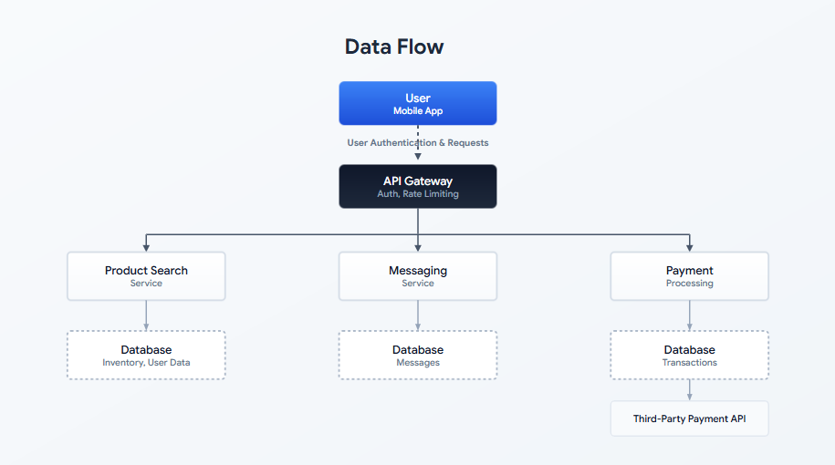
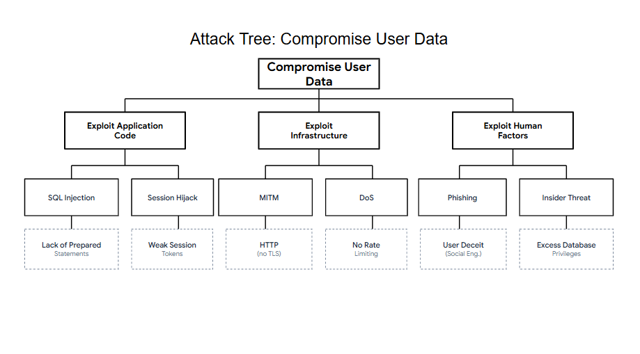

# PASTA Threat Model Worksheet: Sneaker Company App

**Date:** August 25, 2026  
**Author:** Chadrack Kalongo Kabinda  
**Course:** Google Cybersecurity Certificate – Course 5  

---

## Scenario

A sneaker company is preparing to launch a mobile app that allows customers to buy and sell shoes. As part of the security team, I performed a threat model using the **PASTA** (Process of Attack Simulation and Threat Analysis) framework to identify security requirements and potential risks before the app launch.

---

## PASTA Worksheet

| Stage | Sneaker Company App |
| :--- | :--- |
| **I. Define Business and Security Objectives** | 1. Seamlessly connect buyers and sellers through a secure and easy‑to‑use platform.    2. Provide secure payment processing with multiple payment options to ensure smooth transactions and avoid legal issues.    3. Enable direct messaging between buyers and sellers, and allow buyers to rate sellers to encourage good service.    4. Protect user data privacy and ensure responsible handling of personal and payment information. |
| **II. Define the Technical Scope** | The application will use the following technologies:    - **Application Programming Interface (API):** To enable communication between the mobile app, backend servers, and third‑party payment processors.    - **Public Key Infrastructure (PKI):** To issue and manage digital certificates for secure communications (HTTPS/TLS) using AES and RSA encryption.    - **SHA-256:** To hash passwords and verify data integrity.    - **SQL:** To store and query user data, inventory, transaction history, and ratings in a relational database.    **Justification:** I prioritized **API security** because the app relies heavily on APIs for all core functions – user authentication, product search, messaging, and payment processing. A compromised API could expose sensitive user data, payment information, and business logic. Protecting the API with strong authentication, rate limiting, and input validation is essential to the app's security. |
| **III. Decompose Application** | **Data Flow Diagram:**        The data flow diagram illustrates how information moves through the app. A user search request passes through the API Gateway to the Product Search Process, which queries the database and returns inventory listings. Messaging and payment flows follow similar paths, with payment processing also interacting with third‑party APIs. All communication is secured with HTTPS/TLS. |
| **IV. Threat Analysis** | **Internal Threats:**   - Disgruntled employees with access to the database could steal or modify user data (e.g., PII, payment information).   - Developers with excessive privileges could introduce backdoors or insecure code.    **External Threats:**   - Attackers could exploit the API to perform **brute‑force attacks** on user accounts.   - Attackers could intercept unencrypted data in transit (e.g., Man‑in‑the‑Middle attacks).   - Attackers could use **social engineering** (phishing) to trick users into revealing their login credentials. |
| **V. Vulnerability Analysis** | 1. **SQL Injection:** If user input is not properly sanitized, an attacker could inject malicious SQL queries to extract, modify, or delete data from the database.    2. **Weak Session Management:** If session tokens are not generated securely or are not invalidated after logout, an attacker could hijack user sessions and impersonate legitimate users.    3. **Insecure API Endpoints:** If API endpoints lack proper authentication and rate limiting, attackers could perform brute‑force attacks or overload the system with excessive requests (DoS). |
| **VI. Attack Modeling** | **Attack Tree:**        The attack tree shows potential paths an attacker could take to compromise user data. These include exploiting application code (SQL injection, session hijacking), infrastructure (Man‑in‑the‑Middle, DoS), and human factors (phishing, insider threats). Each branch represents a possible attack vector that must be defended against. |
| **VII. Risk Analysis and Impact** | **Security Controls to Reduce Risk:**    1. **Input Validation & Parameterized Queries:** Prevent SQL injection by sanitizing all user input and using prepared statements.    2. **Multi-Factor Authentication (MFA):** Add an extra layer of security for user accounts, especially for sellers and administrators.    3. **Encryption (TLS & AES):** Encrypt data in transit (TLS/HTTPS) and at rest (AES) to protect sensitive information from interception or theft.    4. **Rate Limiting & API Throttling:** Prevent brute‑force attacks and DoS by limiting the number of requests a user can make in a given time period.    5. **Regular Security Audits & Penetration Testing:** Proactively identify and remediate vulnerabilities before attackers can exploit them.    6. **Secure Session Management:** Use strong, random session tokens, enforce HTTPS-only cookies, and invalidate sessions after logout or inactivity. |

---

## Reflection

The PASTA threat modeling framework provided a structured approach to identifying security risks for the sneaker company app. Key takeaways:

- **Business objectives** – Understanding what the app is supposed to do (connect buyers and sellers, process payments, enable messaging) helps prioritize security controls where they matter most.
- **Technical scope** – Identifying the technology stack (API, PKI, SHA-256, SQL) allowed me to focus on the most critical components.
- **Threat analysis** – Both internal and external threats need to be considered. Employees with excessive privileges, API vulnerabilities, and social engineering are all realistic risks.
- **Vulnerabilities** – SQL injection, weak session management, and insecure API endpoints are common weaknesses that can be mitigated with proper coding practices and security controls.
- **Attack modeling** – Visualizing attack paths (via the attack tree) helps stakeholders understand how an attacker could compromise the system.
- **Security controls** – A combination of input validation, encryption, MFA, rate limiting, and regular testing creates a **defense-in-depth** strategy that significantly reduces the app's risk profile.

This exercise reinforces the importance of integrating security into the software development lifecycle – identifying risks early is far more cost-effective than responding to breaches after they occur.