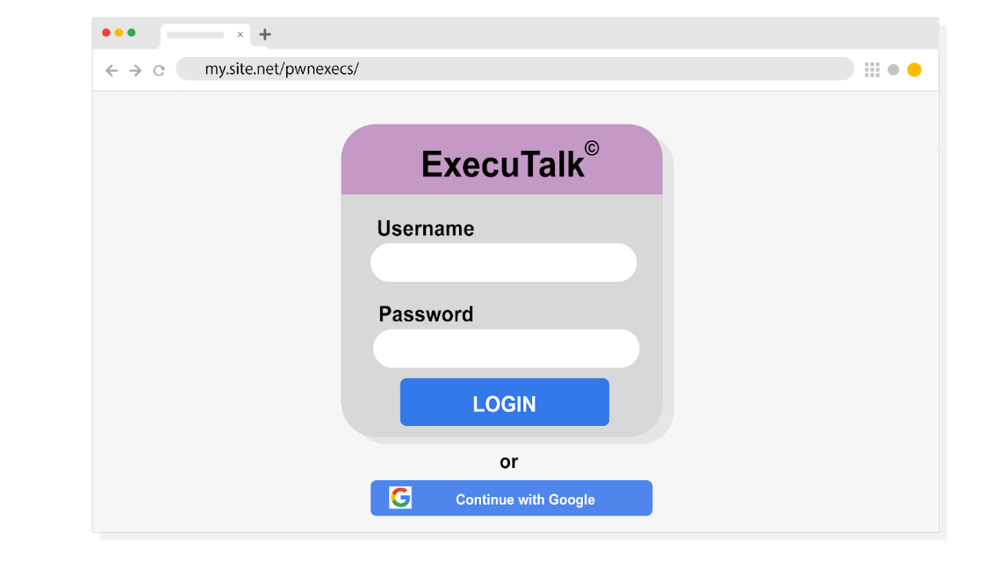

# Phishing Analysis: ExecuTalk Email

**Date:** August 25, 2026  
**Author:** Chadrack Kalongo Kabinda  
**Course:** Google Cybersecurity Certificate – Course 5  

---

## Scenario

I am a security analyst at Imaginary Bank. An executive received a suspicious email asking them to download new collaboration software called "ExecuTalk." The executive suspected phishing because the software was never mentioned during board meetings. My task was to analyze the email and determine if it should be quarantined.

---

## Email Header Analysis

**From:** imaginarybank@gmail.com  
**Sent:** Saturday, December 21, 2019 15:05:05  
**To:** c@imaginarybank.com  
**Subject:** RE: You are been added to an executiv's groups

---

## Clues That Indicate Phishing (Select Two)

| Clue | Why It's Suspicious |
| :--- | :--- |
| **The sender is using a different domain.** | The email claims to be from Imaginary Bank's board, but it was sent from a personal Gmail account (@gmail.com). Legitimate corporate communications would come from the company's official domain (e.g., @imaginarybank.com). |
| **There is a misspelling in the subject line.** | The subject line contains grammatical errors: "You are been added" instead of "You have been added," and "executiv's" instead of "executive's." Legitimate business emails are typically proofread and free of such errors. |

---

## Details That Make the Message Appear Legitimate (Select Three)

```text
Conglaturations! You have been added to a collaboration group ‘Execs.’

Downlode ExecuTalk to your computer.

Mac® | Windows® | Android™ 

You're team needs you! This invitation will expire in 48 hours so act quickly.

Sincerely,

ExecuTalk©

All rights reserved.
```


| Detail | Why It Appears Legitimate |
| :--- | :--- |
| **The brand labeling** | The email includes "ExecuTalk" branding and a professional-looking signature block, which mimics legitimate software vendors. |
| **The download options for major operating systems** | Offering download links for Mac®, Windows®, and Android™ makes the email appear polished and professional, as legitimate software providers do. |
| **The invitation time limit** | The email states that the invitation "will expire in 48 hours," creating a sense of urgency – a tactic that legitimate communications sometimes use to prompt action, but also a common phishing technique. |

---

## Suspicious Login Page Analysis

The download buttons redirect to the following webpage: `my.site.net/pwnexecs/`


**Question:** What is the main clue that indicates this login form is malicious?

**Answer:** The **URL** is the main clue. The domain `my.site.net` does not match the legitimate domain of ExecuTalk or Imaginary Bank. Attackers can easily copy branding, logos, and sign‑in options (like "Continue with Google"), but they cannot fake a legitimate domain without significant effort. A legitimate login page would be hosted on the official company domain (e.g., `executalk.com` or `imaginarybank.com`).



---

## Why This Email Should Be Quarantined

This email exhibits several classic signs of a **spam phishing** attack:

1. **Spoofed sender:** The email claims to be from the board but uses a personal Gmail address.
2. **Grammar and spelling errors:** The subject line contains obvious mistakes.
3. **Urgency:** The 48‑hour expiration is designed to pressure the recipient into acting without thinking.
4. **Suspicious URL:** The download buttons redirect to `my.site.net/pwnexecs/`, which is not a legitimate domain.

**Recommendation:** Quarantine this email immediately. Notify all employees about this phishing attempt and remind them to always verify sender domains, avoid clicking on suspicious links, and report any unusual messages to the security team.

---

## Reflection

This activity reinforced the importance of **email security awareness** and the need to carefully analyze message headers, sender domains, and content for signs of phishing. Key takeaways:

- **Always check the sender's domain** – legitimate organizations do not use personal email accounts for official communications.
- **Look for urgency and pressure tactics** – phishing emails often create a false sense of urgency to trick recipients.
- **Hover over links** – never click on suspicious links; hover to reveal the actual URL. The URL `my.site.net/pwnexecs/` is a clear red flag.
- **Report suspicious emails** – employees should be trained to report phishing attempts to the security team immediately.

---

## Summary of Correct Answers

| Question | Correct Answer |
| :--- | :--- |
| **Which two clues in the message header indicate phishing?** | 1. The sender is using a different domain. <br> 2. There is a misspelling in the subject line. |
| **What details make this message appear legitimate? (Select three)** | 1. The brand labeling <br> 2. The download options for major operating systems <br> 3. The invitation time limit |
| **What is the main clue that indicates the login form is malicious?** | **The URL** (`my.site.net/pwnexecs/`) |
