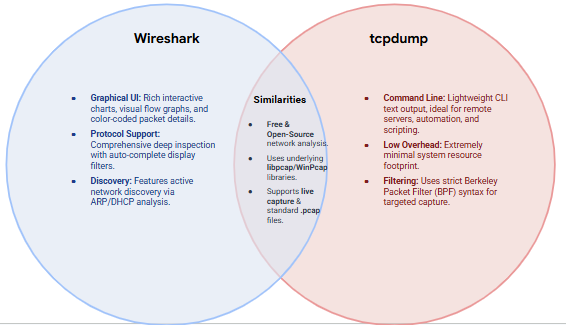

# Network Protocol Analyzers: Wireshark vs. tcpdump

**Date:** August 27, 2026  
**Author:** Chadrack Kalongo Kabinda  
**Course:** Google Cybersecurity Certificate – Course 6  

---

## Overview

Network protocol analyzers (packet sniffers) are tools designed to capture and analyze data traffic within a network. This research compares two widely used tools: **Wireshark** and **tcpdump** – examining their features, differences, similarities, and typical use cases.

---

## Comparison Chart

| Feature | Wireshark | tcpdump |
| :--- | :--- | :--- |
| **User Interface** | Graphical User Interface (GUI) | Command-Line Interface (CLI) |
| **Platform** | Cross-platform (Windows, macOS, Linux) | Primarily Linux/Unix-based (also available on Windows via WinPcap) |
| **Open Source** | ✅ Yes (GPLv2) | ✅ Yes (BSD-style license) |
| **Capture Library** | Uses libpcap (Linux/macOS) or WinPcap/Npcap (Windows) | Uses libpcap (Linux/macOS) or WinPcap (Windows) |
| **Real-time Analysis** | ✅ Yes, with rich visualizations | ✅ Yes, but text-based |
| **Display Filters** | ✅ Yes, with auto-completion and color-coding | ✅ Yes, using BPF (Berkeley Packet Filter) syntax |
| **Protocol Decoding** | Comprehensive, supports hundreds of protocols | Basic, but can be extended with `-v` and `-X` |
| **Packet Capture** | Can capture live traffic and open saved .pcap files | Can capture live traffic and save/read .pcap files |
| **Cost** | Free | Free |
| **Learning Curve** | Steeper – more features to learn | Gentler – focused on command-line capture and filtering |
| **Common Use Cases** | Deep packet inspection, protocol analysis, troubleshooting, education | Quick captures, scripting, remote servers, minimal resource environments |
| **Hexdump Output** | ✅ Yes (in packet details pane) | ✅ Yes (using `-X` or `-xx` flags) |
| **Network Discovery** | ✅ Yes (e.g., via ARP, DHCP analysis) | ❌ No – purely packet capture |
| **Graphical Visualizations** | ✅ Yes (e.g., IO graphs, flow graphs, protocol hierarchy) | ❌ No (text-only output) |

---

## Differences (At Least 2)

| Wireshark | tcpdump |
| :--- | :--- |
| **GUI vs CLI:** Wireshark provides a full graphical interface with packet details, color-coding, and visualization tools. tcpdump is a command-line tool that outputs text to the terminal. | **Ease of Use:** Wireshark is easier for beginners and visual analysis. tcpdump requires familiarity with the command line and BPF filter syntax. |
| **Resource Usage:** Wireshark consumes more system resources (CPU, memory) due to its GUI. tcpdump is lightweight and ideal for remote or resource-constrained environments. | **Target Use Case:** Wireshark is preferred for in-depth analysis and troubleshooting. tcpdump is preferred for quick captures, scripting, and on-the-fly monitoring. |

---

## Similarities (At Least 3)

1. **Both are open-source tools** that can be used free of charge for network analysis.
2. **Both use libpcap/WinPcap** as their underlying packet capture library, supporting .pcap file formats.
3. **Both support display filters** – Wireshark uses its own filter syntax, while tcpdump uses BPF (Berkeley Packet Filter) syntax.
4. **Both can capture live network traffic** and analyze saved packet capture files.
5. **Both are widely used** by security analysts, network engineers, and system administrators for troubleshooting and incident response.
6. **Both support detailed packet inspection**, including headers and payloads (with `-v`/`-X` in tcpdump and in the packet details pane in Wireshark).

---

## Reflection

This comparison highlights the complementary nature of Wireshark and tcpdump. While Wireshark offers a rich graphical interface ideal for deep analysis and education, tcpdump provides a lightweight, scriptable command-line alternative suited for quick captures and resource-constrained environments. In practice, security analysts often use both tools together – capturing traffic with tcpdump on remote servers and analyzing the resulting .pcap files with Wireshark on a local machine.

---

## Sources

- [tcpdump – Resources and Documentation](https://www.tcpdump.org/)
- [Wireshark – Official User Guide](https://www.wireshark.org/docs/)
- [Wireshark vs. tcpdump – Comparison Articles](https://www.google.com/search?q=wireshark+vs+tcpdump)

---

## Screenshots

