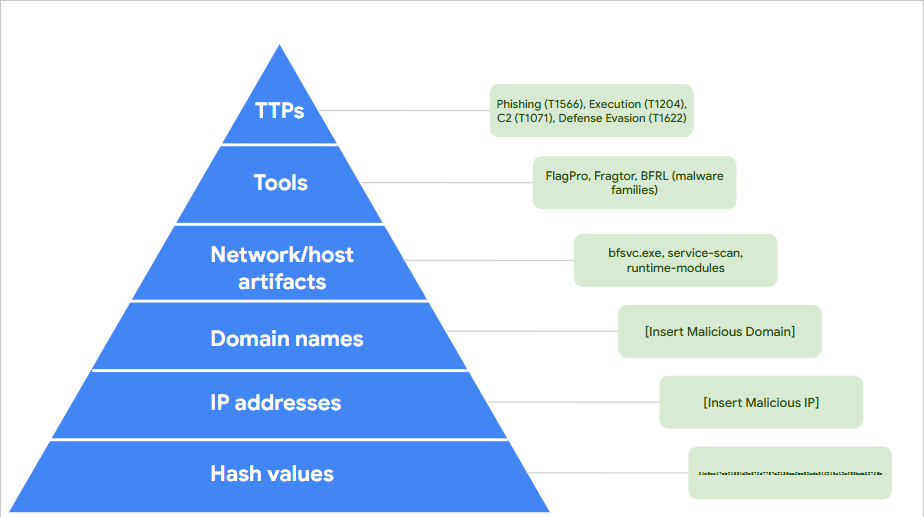
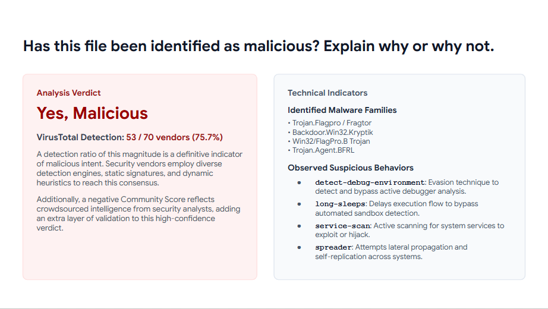

# Pyramid of Pain – VirusTotal Investigation

**Date:** August 28, 2026  
**Author:** Chadrack Kalongo Kabinda  
**Course:** Google Cybersecurity Certificate – Course 6  

---

## Scenario

A financial services company experienced a security incident where an employee received a phishing email containing a password-protected spreadsheet attachment. After opening the file, a malicious payload was executed on their computer. I retrieved the malicious file, generated its SHA256 hash, and used VirusTotal to analyze the file and uncover associated indicators of compromise (IOCs). The findings were mapped to the Pyramid of Pain framework to prioritize defensive actions.

---

## Pyramid of Pain – Indicators of Compromise (IOCs)

| Pyramid Level | IOC | Value / Example |
| :--- | :--- | :--- |
| **TTPs (Tough)** | Tactic / Technique | Phishing (T1566), Execution (T1204), Command and Control (T1071), Defense Evasion (T1622) |
| **Tools (Challenging)** | Malware Families | FlagPro, Fragtor, BFRL |
| **Network/Host Artifacts (Annoying)** | Artifact | `bfsvc.exe`, `service-scan`, `runtime-modules` |
| **Domain Names (Simple)** | Malicious Domain | *[Insert Malicious Domain]* |
| **IP Addresses (Easy)** | Malicious IP | *[Insert Malicious IP]* |
| **Hash Values (Trivial)** | SHA256 | `2f8e0a17ea5d81ddb7c47b7b3f3f9eccefdeed1d21da12cf8ba237c8e` |

---

## Analysis Verdict

### VirusTotal Detection
- **53 / 70** vendors (75.7%)
- A detection ratio of this magnitude is a definitive indicator of malicious intent. Security vendors employ diverse detection engines, static signatures, and dynamic heuristics to reach this consensus.
- Additionally, a negative **Community Score** reflects crowdsourced intelligence from security analysts, adding an extra layer of validation to this high‑confidence verdict.

### Technical Indicators

**Identified Malware Families:**
- Trojan.Flagpro / Fragtor
- Backdoor.Win32.Kryptik
- Win32/FlagPro.B Trojan
- Trojan.Agent.BFRL

**Observed Suspicious Behaviors:**
- `detect-debug-environment`: Evasion technique to detect and bypass active debugger analysis.
- `long-sleeps`: Delays execution flow to bypass automated sandbox detection.
- `service-scan`: Active scanning for system services to exploit or hijack.
- `spreader`: Attempts lateral propagation and self‑replication across systems.

---

## Reflection

This investigation confirmed the value of using VirusTotal to analyze suspicious files and uncover IOCs. The high vendor detection ratio (53/70) and negative community score provided strong evidence that the file was malicious. The Pyramid of Pain framework helped prioritize the IOCs:

- **Hash values** are the easiest to block but also the easiest for attackers to change.
- **IP addresses and domains** are more valuable to block but can be rotated.
- **Network/host artifacts, tools, and TTPs** are the most difficult for attackers to modify and provide the greatest long‑term defense.

The behaviors observed (`detect-debug-environment`, `long-sleeps`, `service-scan`, `spreader`) suggest the malware is designed to evade analysis, persist on the system, and spread to other machines – reinforcing the need for a defense‑in‑depth strategy including email filtering, endpoint detection and response (EDR), and user security awareness training.

---

## Next Steps

- Block the identified IP addresses and domains at the firewall and proxy.
- Quarantine the affected workstation and investigate for lateral movement.
- Update IDS/IPS signatures to detect FlagPro/Fragtor activity.
- Conduct security awareness training on phishing and password‑protected attachments.