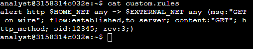
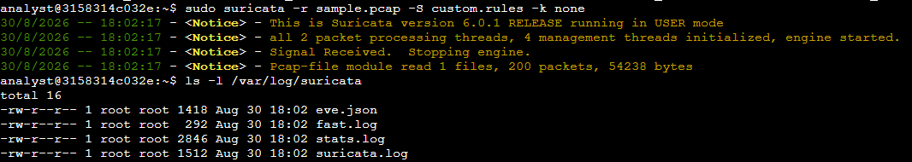
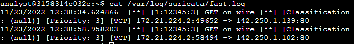
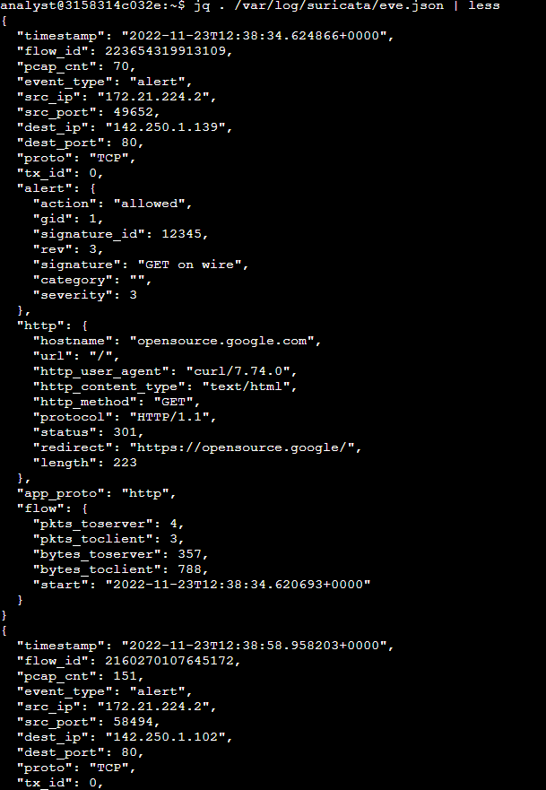
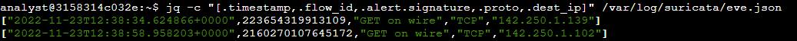

# Suricata IDS Lab: Custom Rules & Log Analysis

**Date:** August 30, 2026  
**Author:** Chadrack Kalongo Kabinda  
**Course:** Google Cybersecurity Certificate – Course 6  

---

## Scenario

As a security analyst, I was tasked with monitoring network traffic using Suricata, an open‑source intrusion detection and prevention system. The goal was to explore custom rule creation, run Suricata against a sample packet capture file (`sample.pcap`), and analyze the generated alerts and log outputs (`fast.log` and `eve.json`). This activity reinforced the fundamentals of network threat detection and alert analysis.

---

## Tools Used

| Tool | Purpose |
| :--- | :--- |
| **Suricata** | Intrusion Detection System (IDS) for network traffic analysis. |
| **`jq`** | Command-line JSON processor for parsing and querying `eve.json`. |
| **`sample.pcap`** | Packet capture file containing example network traffic. |
| **`custom_rules`** | File containing custom Suricata rules to test against the traffic. |
| **`fast.log`** | Deprecated but quick log format for alert counts. |
| **`eve.json`** | Standard JSON log format containing detailed alert information. |

---

## Task 1: Examine a Custom Rule

I examined the contents of the `custom_rules` file to understand the structure of a Suricata rule:

```bash
cat custom_rules
```

Example rule structure:

```text
alert http $HOME_NET any -> $EXTERNAL_NET any (msg:"Suspicious HTTP Request"; sid:100001; rev:1;)
```

**Suricata rules consist of three components:**

| Component| Description | Example |
| :--- | :--- | :--- |
| Action | What to do when a match is found. | `alert`, `drop`, `pass`, `reject` |
| Header | Defines the protocol, source/destination IPs, and ports. | `http $HOME_NET any -> $EXTERNAL_NET any` |
| Options | Additional details, such as the alert message, signature ID (SID), and revision number. | `msg:"Suspicious HTTP Request"; sid:100001; rev:1;` |

---

## Task 2: Run Suricata with the Custom Rule

I ran Suricata against the sample.pcap file using the custom rule file, specifying the log directory for the output:

``bash
sudo suricata -r sample.pcap -S custom_rules -l /var/log/suricata/
```

What this command does:

- `-r sample.pcap`: Reads the packet capture file.

- `-S custom_rules`: Uses the specified custom rule file.

- `-l /var/log/suricata/`: Sets the directory for log output.

---

## Task 3: Analyze the `fast.log` File

I examined the fast.log file to quickly verify whether alerts were generated:

```bash
cat /var/log/suricata/fast.log
```

**Key observation:**
The `fast.log` file displayed a line for each alert triggered by the custom rule. This provided a quick way to confirm that Suricata processed the traffic and matched the rule conditions.

---

## Task 4: Analyze the `eve.json` File with jq

The `eve.json` file contains detailed, structured JSON data. To effectively parse and extract specific information from this file, I used the `jq` command-line tool.

### 4.1 Extracting Specific Fields

I used `jq` to extract only the most relevant fields from the alerts, such as the timestamp, flow ID, alert signature, protocol, and destination IP:

```bash
jq -c "[.timestamp,.flow_id,.alert.signature,.proto,.dest_ip]" /var/log/suricata/eve.json
```

**Command breakdown:**

- `jq -c`: Processes JSON and outputs the result in a compact format (one line per alert).

- `[.timestamp,.flow_id,.alert.signature,.proto,.dest_ip]`: Specifies exactly which fields to extract.

- `/var/log/suricata/eve.json`: The input file.

Why this is useful: This creates a concise, easy-to-read summary of all alerts, allowing an analyst to quickly identify suspicious destination IPs or specific alert types without sifting through the full JSON structure.

### 4.2 Filtering by Flow ID

To investigate a specific network flow in detail, I filtered the eve.json file for a particular flow_id. This is essential for tracking all packets associated with a single session (e.g., from the initial SYN packet to the final ACK).

```bash
jq "select(.flow_id==X)" /var/log/suricata/eve.json
```

(To replace `X` with the actual flow ID found in the previous step).

**Command breakdown:**

`select(.flow_id==X)`: Filters the JSON objects, returning only those with the matching flow ID.

Why this is useful: During an incident investigation, an analyst needs to see the full context of a specific connection – not just the alert that triggered it. This command groups all events belonging to the same flow, providing a complete picture of the attacker's actions.

---

## Key Takeaways

- **Suricata** is a powerful IDS/IPS that can be configured with custom rules to detect specific network threats.
- **Rule structure** (Action, Header, Options) is consistent across Suricata signatures, making it easier to write and maintain rules.
- **`fast.log`** is useful for a quick overview of alert activity, but it lacks the depth needed for thorough investigations.
- **`eve.json`** is the preferred log format for incident response and threat hunting because it contains rich, structured data.
- **`jq`** is an essential tool for parsing JSON logs. It allows analysts to extract specific fields, filter by flow IDs, and create custom reports for investigations.
- **Custom rule testing** against packet capture files is an essential workflow for validating rule effectiveness before deployment in a production environment.

---

## Reflection

This lab solidified my understanding of how IDS tools like Suricata operate in a real‑world SOC environment. Writing and testing custom rules gave me hands‑on experience with the detection logic that underpins many enterprise security monitoring solutions.

The ability to analyze logs like `fast.log` and `eve.json` – and especially using `jq` to parse JSON data – is critical for incident investigation. The `eve.json` file, combined with `jq` filtering, provides the granularity needed to reconstruct an attack timeline and understand the impact on the network.

### Key Skills Reinforced:

- Writing and testing custom IDS rules.
- Running Suricata against packet captures.
- Interpreting alert logs and JSON-structured event data.
- Using `jq` to filter and extract specific log entries for forensic analysis.

---

## Screenshots









