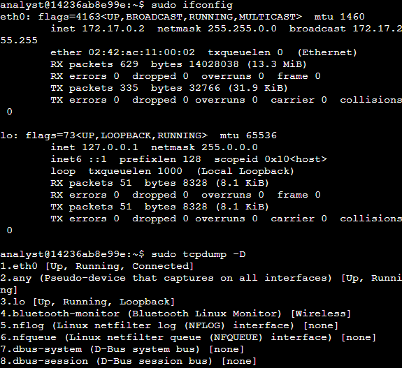
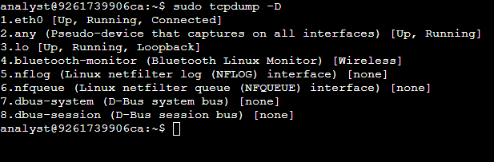
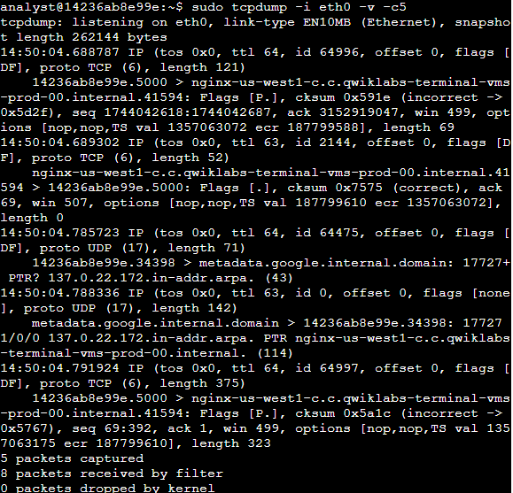
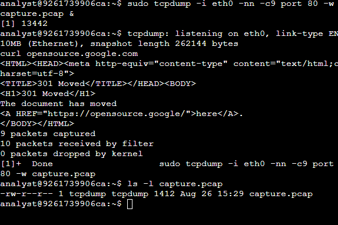
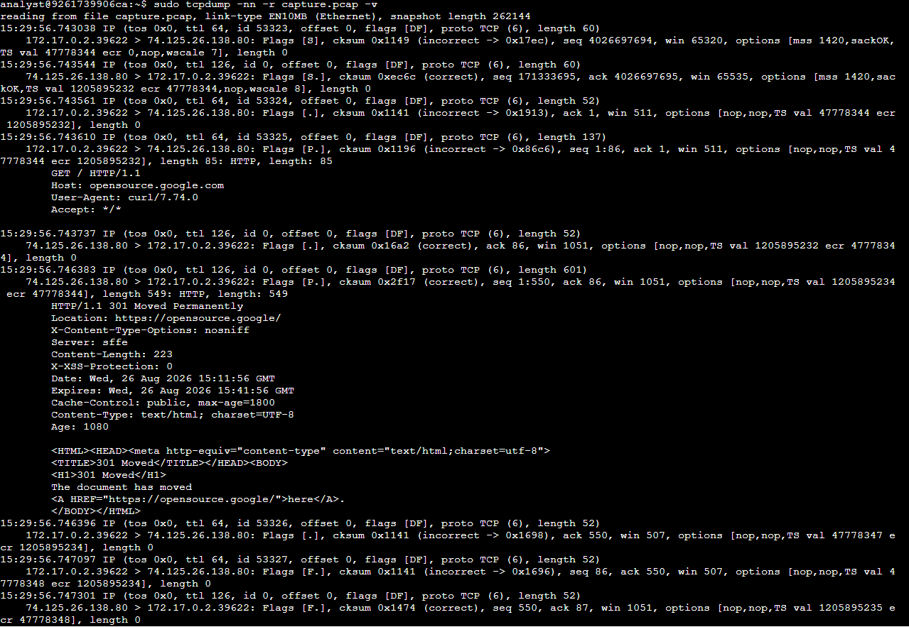
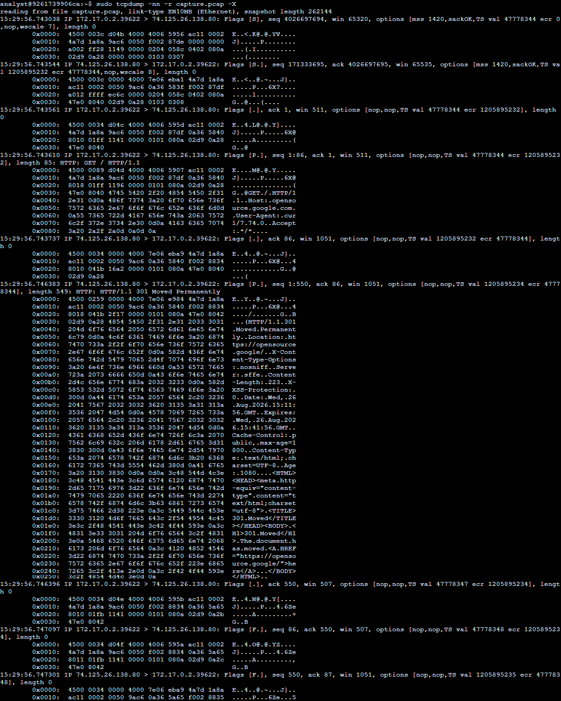

# Tcpdump Packet Capture Lab

**Date:** August 26, 2026  
**Author:** Chadrack Kalongo Kabinda  
**Course:** Google Cybersecurity Certificate – Course 6  

---

## Scenario

As a network analyst, I used `tcpdump` to capture and analyze live network traffic from a Linux virtual machine. The goal was to identify network interfaces, capture packet data, and analyze the traffic to understand the communication between the local machine and a remote web server. This lab reinforced essential skills for network monitoring and incident investigation.

---

## Task 1: Identify Network Interfaces

I used `sudo ifconfig` to list all available network interfaces on the Linux system:

```bash
sudo ifconfig
```
**Output:**
```text
eth0: flags=4163<UP,BROADCAST,RUNNING,MULTICAST>  mtu 1460
    inet 172.17.0.2  netmask 255.255.0.0  broadcast 172.17.255.255
    ether 02:42:ac:11:00:02  txqueuelen 0  (Ethernet)
    RX packets 808  bytes 14053461 (13.4 MiB)
    RX errors 0  dropped 0  overruns 0  frame 0
    TX packets 469  bytes 48706 (47.5 KiB)
    TX errors 0  dropped 0  overruns 0  carrier 0  collisions 0

lo: flags=73<UP,LOOPBACK,RUNNING>  mtu 65536
    inet 127.0.0.1  netmask 255.0.0.0
    inet6 ::1  prefixlen 128  scopeid 0x10<host>
    loop  txqueuelen 1000  (Local Loopback)
    RX packets 66  bytes 10068 (9.8 KiB)
    RX errors 0  dropped 0  overruns 0  frame 0
    TX packets 66  bytes 10068 (9.8 KiB)
    TX errors 0  dropped 0  overruns 0  carrier 0  collisions 0
```

**Key finding:** The `eth0` interface has IP address `172.17.0.2` and is the primary Ethernet interface for this lab environment.

I then used `sudo tcpdump -D` to list interfaces that support packet capture:

```bash
sudo tcpdump -D
```
**Output:**
```text
1.eth0 [Up, Running, Connected]
2.any (Pseudo-device that captures on all interfaces) [Up, Running]
3.lo [Up, Running, Loopback]
4.bluetooth-monitor (Bluetooth Linux Monitor) [Wireless]
5.nflog (Linux netfilter log (NFLOG) interface) [none]
6.nfqueue (Linux netfilter queue (NFQUEUE) interface) [none]
7.dbus-system (D-Bus system bus) [none]
8.dbus-session (D-Bus session bus) [none]
```

**Key finding:** The `eth0` interface is available and ready for packet capture.

---

## Task 2: Inspect Live Network Traffic with tcpdump

I used `tcpdump` to capture live network traffic from the `eth0` interface with the following options:

- `-i eth0`: Capture data specifically for the eth0 interface.

- `-v`: Display detailed packet data.

- `-c 5`: Capture 5 packets of data.

**Command:**
```bash
sudo tcpdump -i eth0 -v -c 5
```


**Analyze the Captured Traffic**

The captured packets revealed a complete HTTP session to opensource.google.com:

### 2.1 TCP Three‑Way Handshake

| Packet | Direction | Flags | Explanation |
| :--- | :--- | :--- | :--- |
| 1 | 172.17.0.2 → 74.125.26.138 | [S] (SYN) | Client initiates connection. |
| 2 | 74.125.26.138 → 172.17.0.2 | [S.] (SYN‑ACK) | Server acknowledges and agrees. |
| 3 | 172.17.0.2 → 74.125.26.138 | [.] (ACK) | Handshake complete. |

### 2.2 HTTP Request

```text
GET / HTTP/1.1
Host: opensource.google.com
User-Agent: curl/7.74.0
Accept: */*
```

**Key observation:** The client used `curl` to request the root page (`/`) of `opensource.google.com`.

### 2.3 HTTP Response (301 Moved Permanently)

```text
HTTP/1.1 301 Moved Permanently
Location: https://opensource.google.com/
X-Content-Type-Options: nosniff
Server: sffe
Content-Length: 223
X-XSS-Protection: 0
Date: Wed, 26 Aug 2026 15:11:56 GMT
Content-Type: text/html; charset=UTF-8
```
**Key observation:** The server responded with a 301 Moved Permanently redirect, instructing the client to use HTTPS (`https://opensource.google.com/`)

### 2.4 Connection Teardown

| Packet | Direction | Flags | Explanation |
| :--- | :--- | :--- | :--- |
| 4 | 172.17.0.2 → 74.125.26.138 | [F.] (FIN‑ACK) | Client initiates connection close. |
| 5 | 74.125.26.138 → 172.17.0.2 | [F.] (FIN‑ACK) | Server acknowledges and closes. |

---

## Task 3: Capture Network Traffic to a File

In this task, I used `tcpdump` to save captured network data to a packet capture (`.pcap`) file. This is useful for offline analysis, sharing with other analysts, and forensic investigations.

### 3.1 Capture and Save Traffic

I ran the following command to capture web traffic (`TCP port 80`) and save it to `capture.pcap`:

```bash
sudo tcpdump -i eth0 -nn -c9 port 80 -w capture.pcap &
```

**Command breakdown:**

| Option | Purpose |
| :--- | :--- |
| -i eth0 | Capture data from the eth0 interface. |
| -nn | Do not resolve IP addresses or ports to names (best practice for security). |
| -c9 | Capture 9 packets and then exit. |
| port 80 | Filter only HTTP traffic (default web port). |
| -w capture.pcap | Save captured data to the named file. |
| & | Run the command in the background. |


### 3.2 Generate Web Traffic

To generate traffic for the capture, I used `curl` to request a webpage:

```bash
curl opensource.google.com
```

### 3.3 Verify the Capture File

I verified that the capture file was created and checked its size:

```bash
ls -l capture.pcap
```

---

## Task 4: Filter and Analyze the Captured Packet Data

In this task, I analyzed the saved `.pcap` file using various `tcpdump` options.

### 4.1 Read and Display Packet Details

I used `-r` to read the capture file and `-v` for verbose output:

```bash
sudo tcpdump -nn -r capture.pcap -v
```

**Key observation:** The output showed the same HTTP session details as the live capture, confirming the file was saved correctly.

### 4.2 Display Hexdump Output

I used `-X` to display packet data in both hexadecimal and ASCII format:

```bash
sudo tcpdump -nn -r capture.pcap -X
```

**Key observation:** The hexdump output showed the raw packet data, including:

- **IP header:** `4500 0033` (Version 4, header length 20 bytes, total length 51 bytes)
- **Source IP:** `ac11 0002` (172.17.0.2)
- **Destination IP:** `4a7d 1a8a` (74.125.26.138)
- **TCP header:** `9ac6 0050` (source port 39622, destination port 80)
- **Payload:** The HTTP request `GET / HTTP/1.1` in both hex and ASCII

```text
0x0000:  4500 0033 04d4 4000 4066 5956 ac11 0002  E..3..@.@fYV....
0x0010:  4a7d 1a8a 9ac6 0050 f002 87de 0000 0000  J}.....P........
0x0020:  a002 f428 1149 0000 0204 058c 0402 080a  ...(.I..........
0x0030:  0249 0a28 0000 0000 0103 0307            .I.(........
```

**Why hexdump matters:** Security analysts use hexdump output to:

- Detect patterns or anomalies during malware analysis
- Identify malicious payloads hidden in packet data
- Perform deep packet inspection (DPI) for forensic investigations
- Understand raw network protocol behavior

---

## Tools Used

| Tool / Command | Purpose |
| :--- | :--- |
| `sudo ifconfig` | List network interfaces and their IP addresses. |
| `sudo tcpdump -D` | List interfaces that support packet capture. |
| `sudo tcpdump -i eth0 -v -c 5` | Capture live traffic with detailed output (5 packets). |
| `sudo tcpdump -i eth0 -nn -c9 port 80 -w capture.pcap` | Capture web traffic and save to a .pcap file. |
| `curl opensource.google.com` | Generate HTTP traffic for capture. |
| `sudo tcpdump -nn -r capture.pcap -v` | Read and display saved capture file. |
| `sudo tcpdump -nn -r capture.pcap -X` | Read capture file with hexdump output. |

---

## Key Takeaways

- **`tcpdump`** is a powerful command-line packet capture tool for Linux.
- **Interface selection** is critical – different interfaces capture traffic from different network segments.
- The **`-nn` flag** prevents name resolution, which is a security best practice and avoids alerting threat actors.
- **Saving to `.pcap` files** allows for offline analysis, sharing, and forensic investigation.
- **Reading `.pcap` files** with `-r` enables post-capture analysis without needing live network access.
- **Hexdump output (`-X`)** displays raw packet data in hexadecimal and ASCII, useful for deep packet inspection and malware analysis.
- **`curl`** can generate HTTP traffic for testing and capture purposes.

---

## Reflection

This lab reinforced the importance of packet capture and analysis in cybersecurity. `tcpdump` is a lightweight, versatile tool that SOC analysts and network engineers use daily to:

- Investigate suspicious traffic
- Identify anomalies
- Troubleshoot network issues
- Perform forensic analysis of network communications
- Save and share packet captures for incident response

By capturing and analyzing the HTTP session to `opensource.google.com`, I observed the entire lifecycle of a web request – from the TCP handshake to the HTTP request, server response, and connection teardown. The ability to save captures to `.pcap` files and analyze them offline is a critical skill for incident response and forensic investigations.

---

## Screenshots












