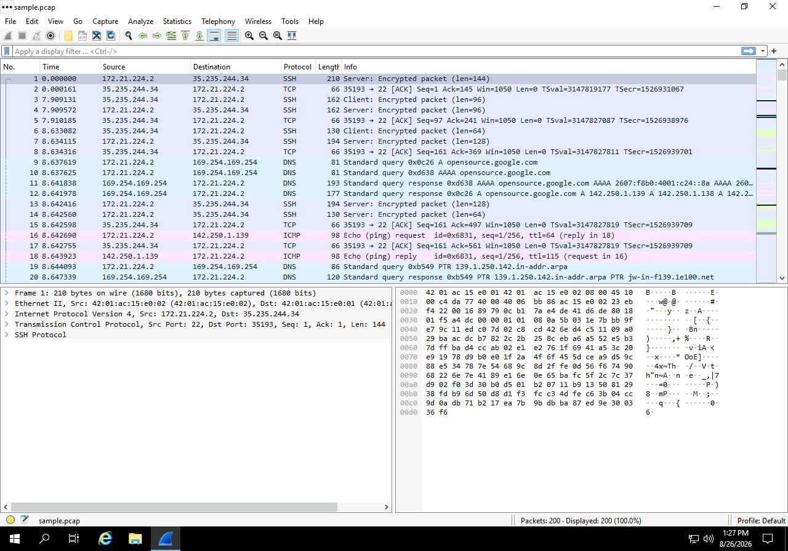
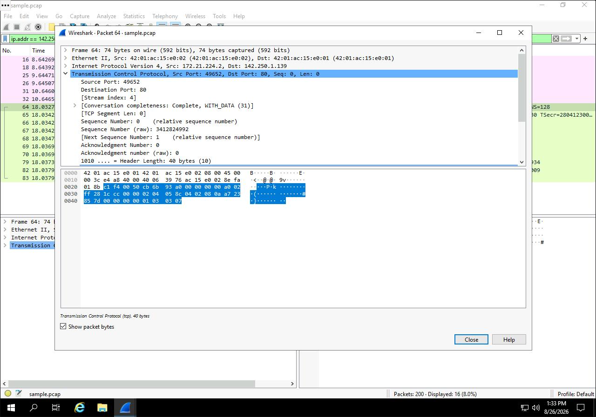
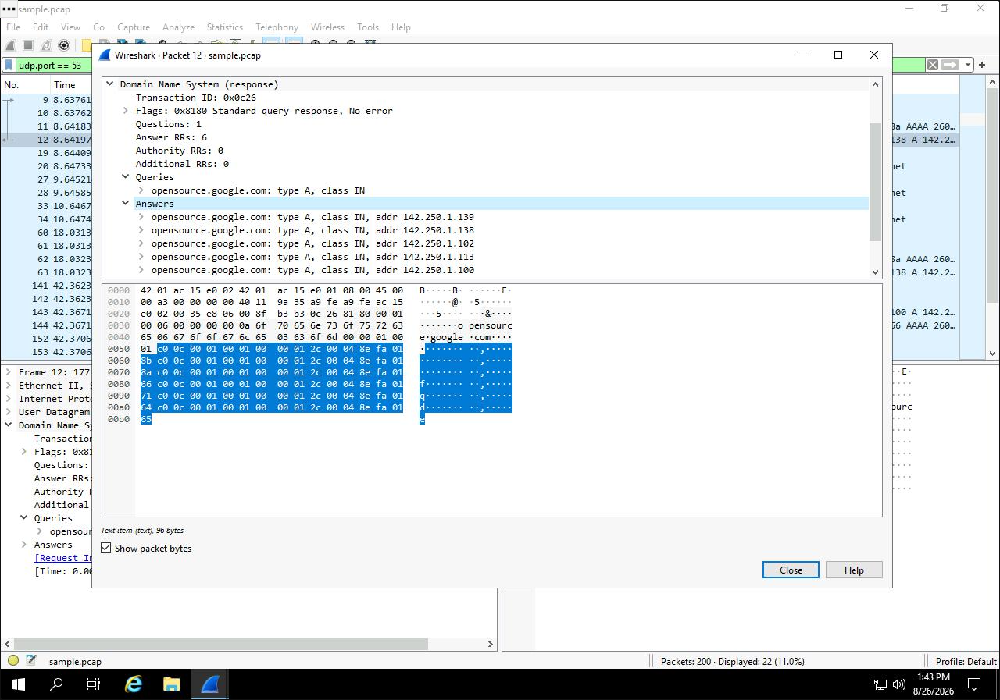
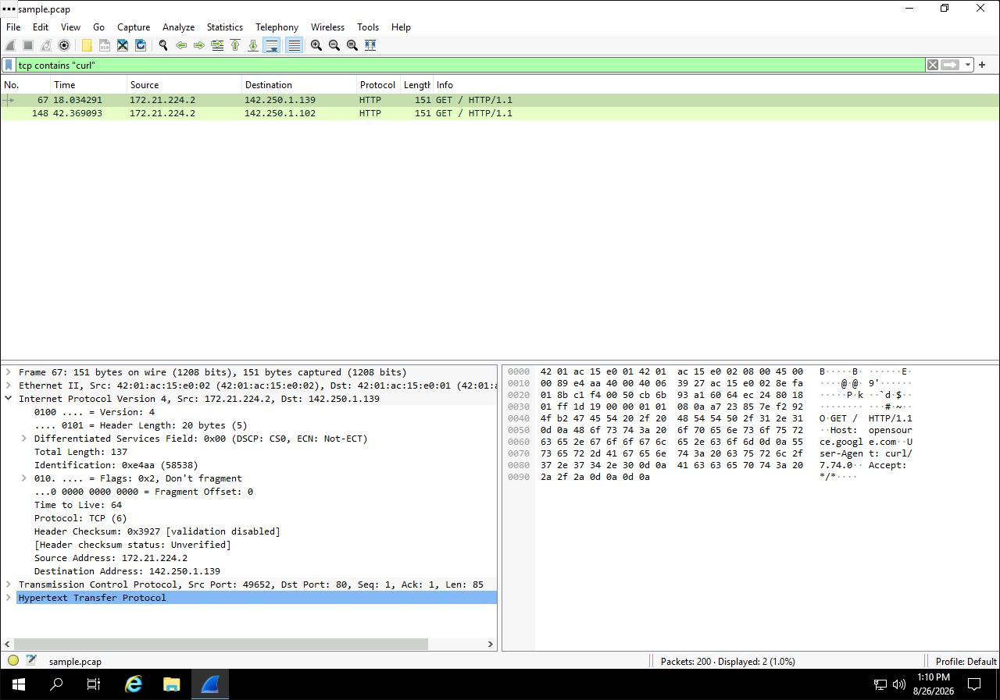

# Wireshark Packet Analysis Lab

**Date:** August 26, 2026  
**Author:** Chadrack Kalongo Kabinda  
**Course:** Google Cybersecurity Certificate – Course 6  

---

## Scenario

As a security analyst, I investigated network traffic related to a user connecting to a website. I analyzed a sample packet capture file using Wireshark to identify source and destination IP addresses, examine protocols used during the connection, and inspect packet data to understand the type of information being transmitted. This activity reinforced essential skills for network analysis and incident investigation.

---

## Steps Performed

### Task 1: Explore Data with Wireshark

I opened the sample packet capture file (`sample.pcap`) from the Windows desktop. I observed the Wireshark interface, noting the key columns: **No.** (packet index), **Time** (timestamp), **Source** (source IP), **Destination** (destination IP), **Protocol** (protocol type), **Length** (packet size), and **Info** (payload summary). I scrolled through the list to identify the first packet with an ICMP Echo (ping) request.

**Key observation:** The first ICMP Echo (ping) request packet had the protocol **ICMP**.

---

### Task 2: Apply a Basic Wireshark Filter and Inspect a Packet

I applied a display filter for traffic associated with a specific IP address: `ip.addr == 142.250.1.139`

This reduced the packet list to only those where the source or destination IP matched the address. I then double-clicked the first TCP packet to open the detailed packet inspection window.

**Key findings:**
- The **Internet Protocol Version 4** subtree showed the source and destination IP addresses.
- The **Transmission Control Protocol (TCP)** subtree showed the source and destination ports.
- The **TCP destination port** was **80** (HTTP traffic).
- The **TCP Flags** subtree showed detailed flag information.

---

### Task 3: Use Filters to Select Packets

I applied several filters to isolate specific traffic:

| Filter | Purpose | Result |
| :--- | :--- | :--- |
| `ip.src == 142.250.1.139` | Traffic from a specific source IP | Only packets from that IP address. |
| `ip.dst == 142.250.1.139` | Traffic to a specific destination IP | Only packets sent to that IP address. |
| `eth.addr == 42:01:ac:15:e0:02` | Traffic related to a specific MAC address | Packets to/from that MAC address. |

**Key finding:** The first packet related to the MAC address `42:01:ac:15:e0:02` contained the protocol **TCP** in the Internet Protocol Version 4 subtree.

---

### Task 4: Use Filters to Explore DNS Packets

I applied a filter to select DNS traffic, which uses UDP port 53: `udp.port == 53`

I double-clicked the first DNS packet and expanded the **Domain Name System (query)** subtree. The **Queries** section showed that the website queried was `opensource.google.com`.

I then double-clicked the fourth DNS packet and expanded the **Answers** section, which showed the resolved IP address.

**Key finding:** The IP address associated with `opensource.google.com` was **142.250.1.139**.

---

### Task 5: Use Filters to Explore TCP Packets

I applied a filter to select web traffic on TCP port 80: tcp.port == 80

I double-clicked the first packet in the list and examined the details:

| Property | Value |
| :--- | :--- |
| **Time to Live (TTL)** | 128 |
| **Frame Length** | 74 bytes |
| **Header Length** | 60 bytes |
| **Destination Address** | 169.254.169.254 |

Finally, I applied a filter to search for packets containing the text `"curl"`, which filters to web requests made with the `curl` command: `tcp contains "curl"`

---

## Tools Used

| Tool | Purpose |
| :--- | :--- |
| **Wireshark** | Network protocol analyzer for inspecting packet data. |
| **Display Filters** | Used to isolate specific traffic based on IP, MAC, port, or payload content. |
| **Packet Details Pane** | Provided in-depth analysis of packet headers and payload. |

---

## Key Takeaways

- **Wireshark** is a powerful tool for analyzing network traffic and investigating security incidents.
- **Display filters** allow analysts to focus on specific traffic patterns (e.g., by IP, MAC, port, or protocol).
- **DNS traffic** uses UDP port 53; inspecting DNS queries and answers can reveal domain resolution activity.
- **TCP port 80** is used for HTTP web traffic; inspecting TCP details (ports, flags, TTL) provides insight into connection behavior.
- **Payload filtering** (`tcp contains "curl"`) helps locate specific user activity in packet captures.

---

## Reflection

This lab reinforced the importance of network analysis in cybersecurity. Wireshark's ability to capture, filter, and inspect packets is essential for detecting malicious activity, investigating incidents, and understanding normal network behavior. In a SOC environment, analysts often start with broad filters and then drill down into specific packets to identify the root cause of an anomaly or attack.

---

## Screenshots

